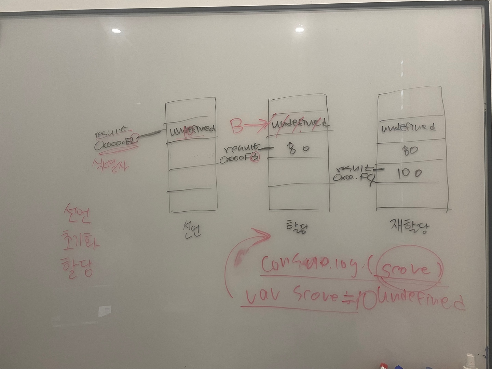

# 04장. 변수
> 👩‍ 설명: 류재경<br/>
> 📝 정리: 류재경



<br/>

### 4-1. 변수가 무엇인가? 왜 필요한가?
---
- 변수
    - 식별자
    - 하나의 값을 저장하기 위해 확보한 메모리 공간 자체 또는 그 메모리 공간을 식별하기 위해 붙인 이름
- 구성
    - 변수 명 : 메모리 공간에 저장된 값을 식별할 수 있는 고유한 이름
    - 변수 값 : 변수에 저장된 값
    - 할당 : 값을 변수에 저장(대입, 저장)
    - 참조 : 변수에 저장된 값을 읽어들이는 것
- 필요성
    - 기억하고 싶은 값을 메모리에 저장하고, 저장된 값을 읽어 들여 재사용하기 위해

<br/>

### 4-2. 식별자(Identifier)
---
- 변수명
- 식별자는 어떤 값이 저장되어 있는 메모리 주소를 기억한다.
- 식별자는 값이 저장되어 있는 메모리 주소(0x0669F913)와 매핑관계를 맺으며, ~~매핑 정보도 메모리에 저장되어야 한다.~~

<br/>

### 4-3. 변수 선언(Variable declaration)

---

- 변수의 생성 단계
    1. **선언**(Declaration)
        
        ```jsx
        var score; //변수 선언문
        ```
        
        - 변수 이름을 등록하여 값을 저장할 메모리 공간을 확보(allocate)하고, 변수이름과 메모리 공간의 주소를 연결(name binding)하여 자바스크립트 엔진에 변수의 존재를 알림
        - `var`, `let`, `const` 키워드를 사용
        - 선언하지 않은 식별자에 접근하면 ReferenceError(참조 에러)가 발생
    2. **초기화**(Initialization)
        - 변수가 선언된 이후 최초로 값을 할당하는 것
        - `var` 키워드를 사용한 변수 선언시, 선언 단계와 초기화 단계가 동시에 진행된다
            - 암묵적 초기화
                - 값을 저장하기 위한 메모리 공간을 확보하고 암묵적으로 undefined를 할당해 초기화한다
                - 메모리 공간을 확보한 다음, 값을 할당하지 않은 상태에서 곧바로 변수 값을 참조하면 쓰레기 값(garbage value)이 나올 수 있기 때문에 필요함.
    3. **할당**(Assignment)

<br/>

### 4-4. 변수 선언의 실행 시점과 변수 호이스팅

---

- 변수 선언은 런타임 이전단계에서 먼저 실행된다(소스코드의 평가과정)
    - 변수 선언이 소스코드의 어디에 위치하는지와 상관 없이 어디서든지 변수를 참조 가능
        
        ```jsx
        console.log(score); //undefined
        var score;
        ```
        
- 호이스팅(Hoisting)
    - 선언문이 코드의 선두로 끌어 올려진 것처럼 동작하는 자바스크립트의 고유 특징
    - 변수, 함수, 클래스 등 모든 식별자

<br/>

### 4-5. 값의 할당(Assignment)

---

- 값의 할당은 소스코드가 순차적으로 실행되는 시점인 런타임에 실행된다
    
    ```jsx
    console.log(score); //undefined
    
    var score; //선언
    score = 100; //할당(재할당)
    // var score = 100; 단축표현
    
    console.log(score); //100
    ```
    
- 변수에 값을 할당할때, undefined가 저장되어 있던 메모리 공간을 지우고 새로운 값을 저장하는 것이 아니라 새로운 메모리 공간을 확보하고 그곳에 새로운 값을 저장한다.

<br/>

### 4-6. 값의 재할당

---

- 재할당
    - 이미 값이 할당되어 있는 변수에 새로운 값을 또다시 할당하는 것
    - 상수(constant)는 재할당할 수 없다 - `const`
        
        ```jsx
        var num = 80;
        num = 100; //재할당
        ```
        

- 새로운 메모리 공간을 확보하여 그 메모리 공간에 할당값을 저장 후, 식별자를 새로 할당한다
    - 이 과정에서 식별자가 사라져 접근할 수 없는 데이터가 남게되는데, 이는 가비지 콜렉터에 의해 메모리에서 자동 해제된다
        
        
        
    
- 가비지 콜렉터(Garbage collector)
    - 어떤 식별자도 참조하지 않는 메모리 공간을 주기적으로 검사하여 더이상 사용되지 않는 메모리를 해제(release)하는 기능
    - 메모리 누수(Memory leak)를 방지한다
    - 자바스크립트는 가비지 콜렉터가 메모리를 관리 (매니지드 언어)
        
        <aside>
        ✔️ 메모리 관리 방식에 따른 프로그래밍 언어 분류
        
        |  | 매니지드 언어 | 언매니지드 언어 |
        | --- | --- | --- |
        | 메모리 제어 | 가비지 콜렉터가 수행
        (개발자가 관여 불가) | 개발자가 주도 |
        | 특징 | 생산성 확보, 성능손실 | 개발자의 역량에 의존 |
        | 언어 | 자바스크립트 | C언어 |
        </aside>
        
    
<br/>

### 4-7. 식별자 네이밍 규칙

---

- 좋은 변수 이름이란(가독성)
    - 식별자 네이밍 규칙을 따르는 변수
    - 네이밍 컨벤션을 잘 지킨 변수
- 자바스크립트 식별자 네이밍 규칙
    - 식별자는 특수문자를 제외한 문자, 숫자, 언더스코어(_), 달러 기호($)를 포함할 수 있다
    - 단, 식별자는 특수문자를 제외한 문자(_, $)로 시작해야 한다 (숫자로 시작 x)
    - 예약어는 식별자로 사용할 수 없다
- 네이밍 컨벤션 종류
    
    ```jsx
    //a. 카멜 케이스(camelCase)
    var firstName;
    
    //b. 스네이크 케이스(snake_case)
    var first_name;
    
    //c. 파스칼 케이스(PascalCase)
    var FirstName;
    
    //d. 헝가리언 케이스(typeHungariamCase)
    var strFirstName; //type + identifier
    var $elem = document.getElementById('myId'); // DOM 노드
    var observable$ = fromEvent(document, 'click'); // RxJS 옵져버블
    ```
    
    - 높은 가독성을 위해 일반적으로 변수나 함수의 이름에는 카멜 케이스를 사용하고, 생성자 함수나 클래스 이름에는 파스칼 케이스를 사용한다.
