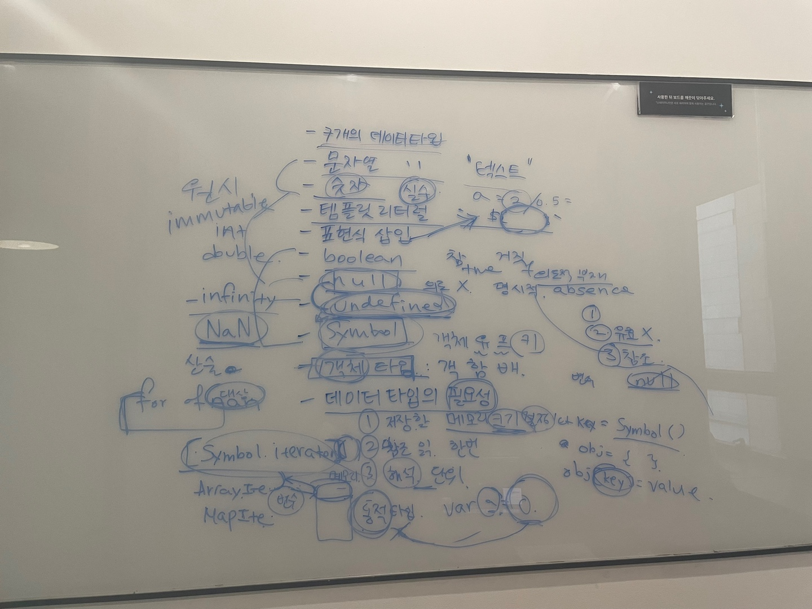

# 06장. 데이터 타입
> 👩‍ 설명: 박하은<br/>
> 📝 정리: 박하은



## 데이터 타입

JS는 총 7개의 데이터타입을 가집니다.

그중에서도 원시타입인 것들은 문자열, 숫자, `null`, `undefined`, `Symbol`, `boolean` 타입이고 객체나 함수, 배열이 속하는 객체 타입이 있습니다. 
데이터 타입에 따라 확보해야할 메모리 공간의 크기, 메모리에 저장되는 2진수, 해석하는 방식이 모두 다릅니다.

### 6.1 숫자 타입

`int`, `long`, `float`, `double` 등 다양한 숫자 타입이 있는 언어들과 다르게 JS에는 숫자 타입이 딱 한가지입니다. 
또 모든 수를 실수로 처리합니다. 정수, 실수, 2진수, 8진수 리터럴 모두 메모리엔 2진수로 저장됩니다. 
또 JS에선 `Infinity로` 양의 무한대, `-Infinity`로 음의 무한대, `NaN`(Not a Number)로 산술 연산이 불가능한 값을 표현할 수 있습니다.

### 6.2 문자열 타입

문자열 타입은 키워드나 식별자 같은 토큰과 구분하기위해 따옴표로 감싸 사용합니다. 
JS의 문자열은 원시 타입이며 변경 불가능한 값(immutable)입니다. 즉, 문자열이 생성되면 그 문자열을 변경할 수 없습니다.

### 6.3 템플릿 리터럴

ES6에 도입된 문자열 표기법입니다. 

```js
let template = `Template Literal`
let multilineTemplate = `여러 줄로
					작성하는 것도 가능합니다.`
```

#### 6.3.2 표현식 삽입

템플릿 리터럴 안에서는 백틱을 사용해 문자열 안에 표현식(`${}`)을 넣을 수도 있습니다. 이때 표현식의 평가 결과가 문자열이 아니더라도 문자열로 타입이 강제로 변환되어 삽입됩니다.

### 6.4 불리언 타입

논리적 참을 나타내는 `true`와 거짓을 나타내는 `false`가 있습니다.

### 6.5 undefined 타입

`undefined` 타입은 `undefined`가 유일합니다. `var` 키워드로 선언한 변수는 암묵적으로 `undefined`로 초기화됩니다. 
즉, `undefined`는 자바스크립트 엔진이 변수를 초기화할 때 사용하는 값입니다. `undefined`를 개발자가 의도적으로 변수에 할당하는 것은 취지에 어긋나므로 권장하지 않습니다.

### 6.6 null 타입

`null` 타입은 `null`이 유일합니다. `null`은 변수에 값이 없다는 것을 의도적으로 명시(의도적 부재, intentional absence)하거나 
함수가 유효한 값을 반환할 수 없는 경우에 사용합니다. 변수에 null을 할당하면 변수가 이전에 참조하던 값을 더 이상 참조하지 않겠다는 의미이고, 
이것은 이전에 할당되어있던 값에 대한 참조를 명시적으로 제거하는 것입니다. 그 결과 JS 엔진이 누구도 참조하지 않는 메모리 공간이기에 가비지 컬렉션을 수행합니다. 

### 6.7 심벌 타입

`Symbol`은 변경 불가능한 원시 타입의 값이자 다른값과 중복되지 않는 유일무이한 값입니다.
이름이 충돌할 위험이 없는 객체의 유일한 프로퍼티 키를 만들기 위해 사용합니다.
`Symbol` 함수를 호출해 생성할 수 있고, 그 안에 문자열을 파라미터로 넣어 그 심볼을 설명해줄 수 있습니다.
생성된 심벌값은 외부에 노출되지 않고, 다른 값과 절대 중복되지 않는 유일무이한 값입니다.

```js
let key = Symbol('key');
let obj = {};
obj[key] = 'value';
```

### 6.8 객체 타입

JS는 객체 기반의 언어이며, JS를 이루는 거의 모든 것이 객체입니다.

### 6.9 데이터 타입의 필요성

데이터타입은 이런 이유들로 사용합니다.

1. 값을 저장할 때 확보할 메모리 공간의 크기를 결정하기 위해 
- 몇 바이트의 메모리 공간을 사용해야 낭비와 손실이 없을지 정해야합니다. JS는 변수에 '할당되는 값'의 데이터 타입에 따라 확보해야할 메모리 공간의 크기가 결정됩니다. 참고로 그 크기는 JS 엔진 제조사의 구현에 따라 다를 수 있습니다. 
2. 값을 참조할 때 한번에 읽어들어야할 메모리 공간의 크기를 결정하기 위해
3. 메모리에서 읽어들인 2진수를 어떻게 해석할지 결정하기 위해
