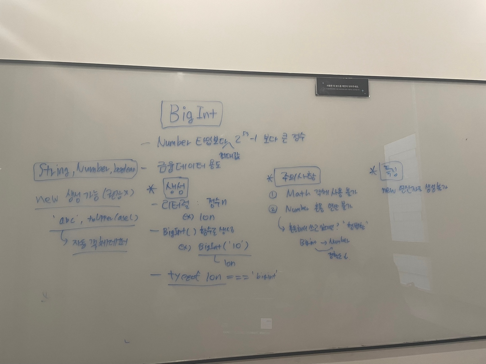

# 심화 학습
> 👩‍ 설명: 황희정 
> 📝 정리: 황희정

## BigInt 타입

### Agenda

#### 1. BigInt 타입이란?
#### 2. BigInt 특징
#### 3. 생성법
#### 4. 주의사항

[내용 정리 바로가기](https://github.com/goatFE/TIL/blob/main/JavaScript/BigInt.md)
