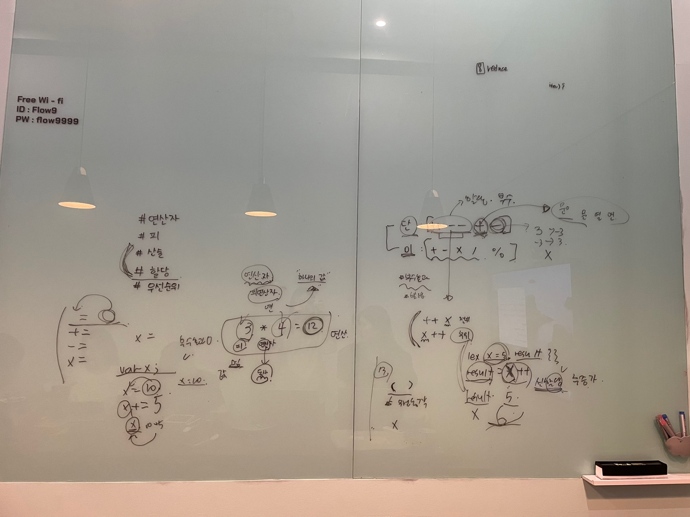

### 07장. 연산자 - 1

> 👩‍ 담당자: 양현화<br/>
> 📝 파트: 연산자, 피연산자 용어, 산술연산자, 할당연산자, 연산자 우선순위



# 07장. 연산자

- 연산자는 하나 이상의 표현식을 대상으로
- 산술, 비교, 할당, 논리, 타입, 지수 연산 등을 수행해
- **하나의 값을 만든다.**
- 연산의 대상 : 피연산자
  - 값으로 평가될 수 있는 표현식 이여야 한다.
- 피연산자와 연산자의 조합으로 이뤄진 연산자 표현식도 값으로 평가될 수 있는 표현식이다.

- 피연산자 : ‘값’ 이라는 `명사 역할`
- 연산자 : ‘피연산자를 연산하여 새로운 값을 만든다.’ `동사 역할`

- 피연산자는 연산의 대상이 되어야 하므로 값으로 평가할 수 있어야 한다. 연산자는 값으로 평가된 피연산자를 연산해 새로운 값을 만든다.

### 7.1 산술 연산자

- 피연산자를 대상으로 수학적 계산을 수행해 새로운 숫자 값을 만든다.
- 산술 연산이 불가능한 경우, NaN을 반환한다.

- `부수효과?` 사이드이펙트, 피연산자의 값이 변경되는 경우.

| 분류                 | 산술 연산자 | 의미                                                 | 부수효과 |
| -------------------- | ----------- | ---------------------------------------------------- | -------- |
| 이항 산술 연산자     | +           | 덧셈                                                 |          |
|                      | -           | 뺄샘                                                 |          |
|                      | \*          | 곱샘                                                 |          |
|                      | /           | 나눗셈                                               |          |
|                      | %           | 나머지                                               |          |
| 단항 산술 연산자     | ++          | 증가                                                 | O        |
|                      | —           | 감소                                                 | O        |
|                      | +           | 어떠한 효과도 없다. 음수를 양수로 반전하지도 않는다. |          |
|                      | -           | 반전한 값을 반환                                     |
| (양 → 음), (음 → 양) |             |

- **증가/감소 (++/—) 연산자는 위치에 의미가 있다.**
  | 분류 | 위치 | 순서 | 해석 |
  | ------------------------- | ----------------------------------- | --------------------------------- | ---- |
  | 전위 증/감 연산자 | 피연산자 앞에 위치 | 피연산자의 값을 증가/감소 시킨 후 다른 연산을 수행한다. | 변수 값을 먼저 증/감 → 그 값을 사용 |
  | 후위 증/감 연산자 | 피연산자 뒤에 위치 | 다른 연산을 수행한 후, 피연산자의 값을 증가/감소 | 변수의 값을 먼저 사용 → 증/감 |

  ```jsx
  var x = 5,
    result;

  // 선할당 후증가
  result = X++;
  console.log(result, x); // 5 6
  ```

  후위 증감 연산자

  1. x의 현재값인 5를 result에 할당
  2. x의 값 1 증가
  3. result = 5, x = 6

  ```jsx
  // 선증가 후할당
  result = ++x;
  console.log(result, x); // 7 7
  ```

  전위 증감 연산자

  1. x의 값을 1 증가
  2. 증가된 값을 result에 할당
  3. result = 7; x=7

  ***

- **+ 단항 연산자는 피연산자에 어떠한 효과도 없다. 아무런 효과가 없다.**

  - 숫자 타입이 아닌 피연산자에 + 단항 연산자를 사용하면 피연산자를 숫자 타입으로 변환하여 반환한다.
  - 이때 피연산자값을 변경하는 것은 아니고, 숫자 타입으로 변환한 값을 생성해서 반환한다.
  - 따라서 부수효과는 없다.

  ```jsx
  var x = "1";

  console.log(+x); // 1

  x = true;
  console.log(+x); // 1

  x = false;
  console.log(+x); // 0

  x = "Hello";
  console.log(+x); // NaN 문자열을 숫자롵 타입 변환할 수 없다.
  ```

  👀 true: 1, false: 0

- **단항 연산자 는 피연산자의 부호를 반전한 값을 반환한다.**

  - 단항 연산자와 마찬가지로 숫자 타입이 아닌 피연산자에 사용하면 피연산자를 숫자 타입으로 변환하여 반환한다.
  - 이때 피연산자를 변경하는 것은 아니고, 부호를 반전한 값을 생성해 반환한다.
  - 따라서 부수효과는 없다.

- **문자열 연결 연산자**

  - 연산자는 피연산자 중 하나 이상이 문자열인 경우 문자열 연결 연산자로 동작한다.

  ```jsx
  "1" + 2; // 12 문자열 연결 연산자

  1 + 3; // 4 산술연산자

  1 + true; // 2 // true는 1

  1 + false; // 1 // fasle 는 0

  1 + null; // 1 // null 은 0

  +undefined; // NaN
  ```

  ⭐️ **암묵적 타입 변환, 타입 강제 변환이 발생함** : 개발자의 의도와는 상관없이 JS 엔진에 의해 압묵적으로 타입이 자동 변환되기도 한다. (1+treu의 경우 true가 숫자 타입인 1로 타입이 강제 전환됨)

### 7.2 할당 연산자

- 우항에 있는 피연산자의 평가 결과를 좌항에 있는 변수에 할당한다.

| 할당 연산자 | 예      | 동일 표현 | 부수 효과 |
| ----------- | ------- | --------- | --------- |
| =           | x=5     | x=5       | O         |
| +=          | x += 5  | x = x+5   | O         |
| -+          | x -= 5  | x = x-5   | O         |
| \*=         | x \*= 5 | x = x\*5  | O         |
| /=          | x /= 5  | x = x/5   | O         |
| %=          | x %/ 5  | x = x%5   | O         |

```jsx
var x;

x = 10;
console.log(x);

x += 5;
console.log(x);
```

1. x = undefined
2. x = 10;
3. x에 현재 값에 5를 더한 후 → 10 + 5
4. 그 값을 다시 x에 할당한다. → x = 15

- **할당문은 표현식인 문일까, 표현식이 아닌 문일까?**

  ```jsx
  var x;

  console.log((x = 10));
  ```

  - 할당문은 값으로 평가되는 표현식인 문으로서 할당된 값으로 평가된다.
  - 위 예제의 할당문은 x에 할당된 숫자 값 10으로 평가된다.
  - 따라서 할당문을 다른 변수에 할당할 수도 있다.
  - 이러한 특징을 활용해 여러 변수에 동일한 값을 연쇄 할당 할 수 있다.

  ```jsx
  var a, b, c;

  a = b = c = 0;
  ```

  - 연쇄할당 : 오른쪽에서 왼쪽으로 진행
  - c = 0, b = 0, a = 0;

### 7.12 연산자 우선순위

- 여러개의 연산자로 이뤄진 문이 실행될 때 연산자가 실행되는 순서를 말한다.
- 우선순위가 높을수록 먼저 실행된다.

- 우선순위 표 -
  | 우선순위 | 연산자 |
  | --- | --- |
  | 1 | () |
  | 2 | new(매개변수 존재), .. [](프로퍼티 접근), () (함수호출), ?.(옵셔널 체이닝 |
  | 3 | new(매개변수 미존재) |
  | 4 | x++, x— |
  | 5 | !x, +x, -x, ++x, —x, typeof, delete |
  | 6 | \*\* 지수연산자 이항 연산자 중에서 우선순위가 가장 높다. |
  | 7 | \_, /, % |
  | 8 | +, - |
  | 9 | <, < =, >, > =, instanceof |
  | 10 | ==, ! =, ===, ! == |
  | 11 | ?? (null 병합 연산자) |
  | 12 | && |
  | 13 | || |
  | 14 | ? … : … |
  | 15 | 할당 연산자 (=, +=, -=, …) |
  | 16 | , |

- 그룹 연산자를 사용하여 우선순위를 명시적으로 조절하는 것을 권장한다.
