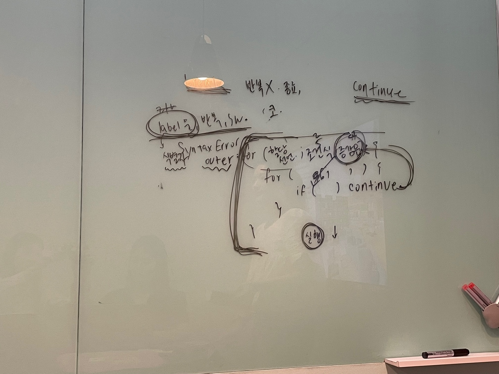

# 08장. 제어문 - 3

> 👩‍ 담당자: 박하은<br/>
> 📝 파트: break문, continue문



## break 문

레이블 문, 반복문, switch 문의 코드블록을 탈출한다. 특히
**반복문을 더이상 진행하지 않아도 될 때 불필요한 반복을 회피**하고자 사용한다.

### 레이블 문(label statement)

식별자가 붙은 문을 말하며, 프로그램의 실행 순서를 제어하는데 사용한다.
사실상 switch 문의 case, default 문도 레이블 문이다. 아래 예시와 같다. 

```js
foo: {
    console.log(1);
    break foo;    // foo 레이블 문을 탈출한다.
}
```

레이블 문은 중첩된 for 문 외부로 탈출할 때 유용하지만 그외의 경우엔 
프로그램의 흐름이 복잡해져 가독성이 나빠질 수 있어 권장되지 않는다.

## continue 문

반복문의 코드 블랙 실행을 현 시점에서 중단하고 반복문의 증감식으로 실행 흐름을 이동시킨다.
break문처럼 반복문을 탈출하지는 않는다.

