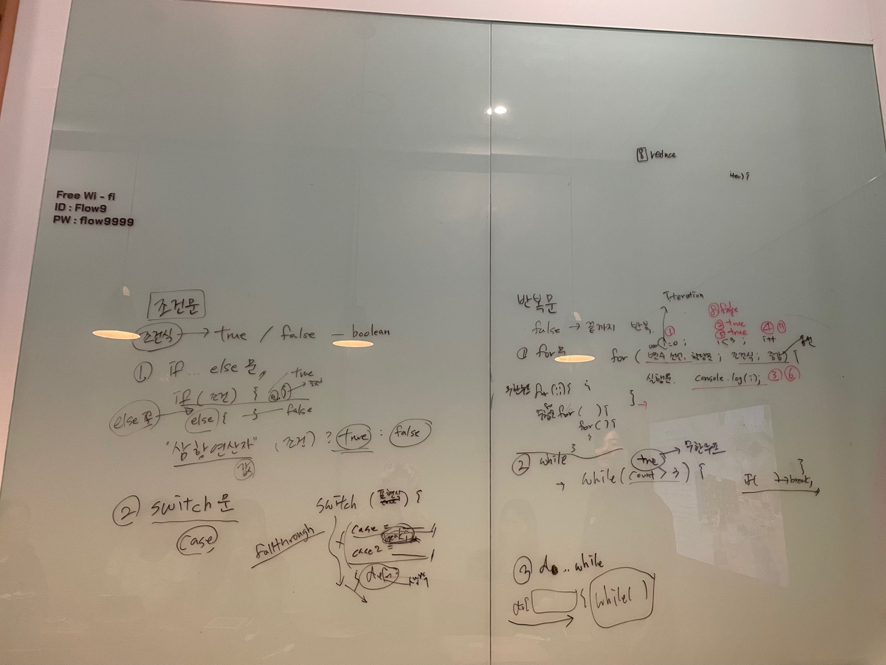

# 08장. 제어문 - 2

> 👩‍ 담당자: 송하<br/>
> 📝 파트: 조건문, 반복문




## 조건문
- 주어진 **조건식**의 평가 결과에 따라 (코드)블록의 실행을 결정
- 조건식은 **불리언 값으로 평가될 수 있는 표현식**을 의미
    - 불리언값이 아닐 경우, **암묵적 타입변환**으로 강제 변환되어 실행할 코드 블록을 결정함

### if ... else 문
- if 문의 조건식의 평과 결과, 논리적 **참 또는 거짓** 에 따라 실행할 코드를 결정
    - true 일 경우 if문의 코드 블록 실행, false 일 경우 else 문의 코드 블록을 실행
    - 조건식을 추가할 경우, else if 문 사용
    - else if문, else 문은 옵션

    ```javascript
    if (조건식) {
	// 조건식이 참이면 이 코드 블록 실행 - true
    } else {
        // 조건식이 거짓이면 이 코드 블록 실행 - false
    }

    if (조건식1) {
        // 조건식1이 참이면 이 코드 블록 실행
    } else if (조건식2) {
        // 조건식2이 참이면 이 코드 블록 실행
    } else {
        // 조건식1과 조건식2가 모두 거짓이면 이 코드 블록 실행
    }
    ```

- 코드 블록 내의 문이 하나 뿐이라면 중괄호 생략 가능
- 대부분은 if ... else 문은 **삼항 조건 연산자** 로 바꿔 쓸 수 있다.
    - 삼항 조건 연산자(값으로 평가되는 표현식) 를 사용하여 변수 할당이 가능하다.
    - if ... else 문은 표현식이 아닌 문이기 때문에, 변수 할당이 불가능하다.
    - **즉, 단순 값을 결정하여 변수에 할당할 경우에는 삼항 조건 연산자가 가독성이 좋다**
    
    ```javascript
    var num = 2;

    // 0은 false로 취급, 이중 삼항조건 연산자
    var kind = num ? (num > 0 ? '양수' : '음수') : '영';

    console.log(kind) // 양수
    ```

### switch 문
- 주어진 표현식을 평가하여 그 값과 일치하는 표현식을 갖는 case 문으로 실행 흐름을 옮김.
    - case 문 (상황을 의미하는 표현식을 지정하고 콜론으로 마침) 뒤에 실행할 문을 위치, break 문을 써서 switch문을 탈출하도록 한다.
    - 일치하는 case 문이 없다면 default 문을 실행한다. (필수는 아님)
    - 맨 마지막에 해당아는 default 문 뒤에는 break 문을 생략한다.
    
    ```javascript
    switch (표현식) {
        case 표현식1: 
            [표현식과 표현식1과 일치하면, 실행될 문]
            break;
        case2 표현식2: 
            [표현식과 표현식2과 일치하면, 실행될 문]
            break;
        default:
            [표현식과 일치하는 case문이 없는 경우 실해될 문]
    }
    ```

- 논리적 참, 거짓은 if ... else문 보다는 **다양한 상황(case)에 따라 실행할 블록을 결정할 때 주로 사용**
- **폴스루 fall through**
    - break 문이 없어 switch 문을 탈출하지 못하고, 모든 case 문과 default문을 실행하는 것
    - 폴스루를 일부러 사용하여, 여러개의 case 문을 하나의 조건처럼 사용할 수 있다.

    ```javascript
    var month = 3;
    var days = 0;

    switch (month) {
        case 1: case 3: case 5: case 7: case 8: case 10: case 12: 
            days = 31;
            break;
        case 4: case 6: case 9: case 11:
            days = 30;
            break;
        default:
            console.log('Invalid month');
    }

    console.log(days); // 31
    ```


## 반복문
- 조건식의 평가 결과가 참인경우 (코드)블록을 실행하여 **거짓일 때까지 반복**
    - forEach 메서드 (배열을 순회), for ... in 문(객체의 프로퍼티 열거), for ... of 문 (이터러블을 순회_ES6에서 추가) 로 대체할 수 있음

### for 문
```javascript
for ( 변수 선언문 또는 할당문; 조건문; 증감식) {
    조건식이 참인 경우 반복될 실행문
}

for ( var i = 0; i <2; i++) {
    console.log(i);
}

// 무한루프 : 코드블록을 무한히 반복 실행
for (;;) {...}
```
- i 변수 (반복을 의미하는 iteration 의 i 를 사용)
- 변수 선언(할당) → 조건식 true → 실행문 → 증감식 → 조건식 .... → 조건식 false 까지 반복
    - 조건식 평가 결과 true 이면 코드 블록을 실행, 증감문으로 실행 흐름이 이동하지 않음에 주의! (**실행 순서 유의**)
- 변수 선언문, 조건문, 증감식 모두 옵션(필수 아님)으로 **어떤 식도 선언하지 않으면 무한 루프**가 된다.
- 중첩 for 문 : for문 내에 for문을 중첩해서 사용

### while 문
- **반복횟수가 불명확할 경우** 주로 사용
```javascript
var count = 0;

while (count > 3) {
	console.log(count);
	count++;
}

//무한루프
while (true) {
	console.log(count);
	count++;

	//탈출하려면?
	if(count === 3) break;
}
```
- 조건식이 항상 참이면 무한 루프
    - if문으로 탈출 조건을 만들고 break 문으로 코드블록을 탈출할 수 있다.

### do ... while 문
- 코드 블록을 먼저 싱행하고 조건식을 평가한다. 즉, 무조건 한 번 이상 코드블록이 실행된다.
```javascript
var count = 0;

do {
	console.log(count);
	count++;
} while ( count > 3);
```