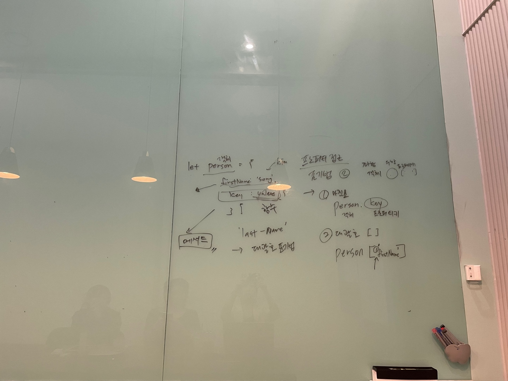

# 10장. 객체 리터럴 - 2

> 👩‍ 담당자: 송하<br/>
> 📝 파트: 메서드, 프로퍼티 접근, 프로퍼티 값 갱신



##10.4 메서드
- 프로퍼티 값이 함수일 경우, 일반 함수와 구분하기 위해 **메서드**라고 부름

***

##10.5 프로퍼티 접근
- 표기법 : (좌측) `객체로 평가되는 표현식` + 프로퍼디 접근 연산자 `. 또는 []` + (우측) 프로퍼티 키  

```javascript
var person = {
	name: 'Song',
    'last-name' : 'ha'
};

// 마침표 표기법
console.log(person.name); // song

// 대괄호 표기법
console.log(person['last-name']); // ha
```
    - 마침표 표기법
    - 대괄호 표기법
        - 프로퍼티 키를 **따옴표로 감싼 문자열**로 표기 (그렇지 않으면 자바스크립트 엔진 식별자로 해석)
- 객체에 존재하지 않는 프로퍼티에 접근 시 : undefined 가 반환됨. `ReferenceError` 발생 안함 주의!
- 프로퍼티 키가 식별자 네이밍 규칙을 준수하지 않는 경우에는 무조건 **대괄호 표기법** 사용

***

##10.6 프로퍼티 값 갱신
- 이미 존재하는 프로퍼티에 값을 할당하면 갱신된다. 