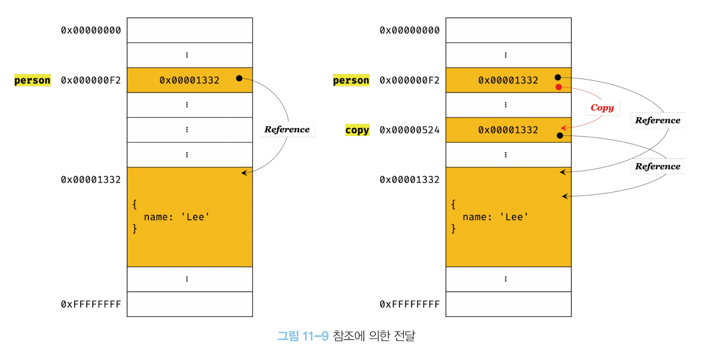

# 11장. 원시값과 객체의 비교 - 3

> 👩‍ 담당자: 송하<br/>
> 📝 파트: 참조에 의한 전달, 값에 의한 전달


## 값에 의한 전달 vs. 참조에 의한 전달
- 원시값과 객체의 차이점 중, 변수를 다른 변수에 할당할 경우에 전달의 차이가 있다.

| \                       | 원시값                                          | 객체                                                  |
| 변수 → 다른 변수에 할당 |	원본의 원시 값이 복사되어 전달 (값에 의한 전달) | 원본의 참조 값이 복사되어 전달 (참조에 의한 전달)변수 |

### 값에 의한 전달 

```jsx
var score = 80;

// copy 변수에 원시값을 가진 score 값 할당
var copy = score;

console.log(score, copy); // 80 80
console.log(score === copy); // true

// 원시값을 재할당하여 변경할 경우, 
// 메모리 공간이 다른 별개의 값이기 때문에 copy 변수의 값에는 영향을 주지 않는다.
score = 100;

console.log(score, copy); // 100 80
console.log(score === copy); // false
```

- 값의 의한 전달 : 변수에 원시값을 갖는 변수를 할당하면, 원시값이 복사되어 전달되는 것
    - 하지만 두 변수가 갖는 동일한 원시값은 **다른 메모리 공간에 저장된 별개의 값**이다.
    - 하나의 변수 값을 변경해도 영향을 주지 않는다.

### 11.2.2 참조에 의한 전달

- 참조에 의한 전달 : 객체를 가르키는 변수를 다른 변수에 할당하면, 원본의 참조 값이 복사되어 전달되는 것



- 원본 person, 사본 copy 모두 동일한 객체를 가리킴 → 두 개의 식별자가 하나의 객체를 공유
    - 어느 한 쪽에서 객체를 변경할 경우, 서로 영향을 주고 받음