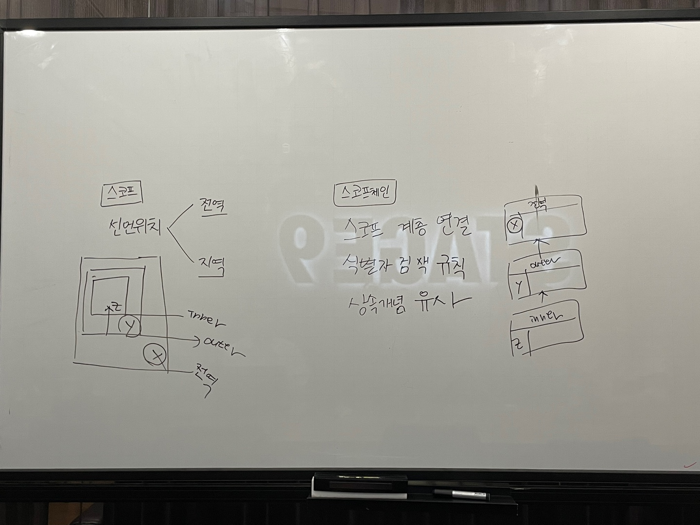

# 13장. 스코프 - 2

> 👩‍ 담당자: 류재경 
> 📝 파트: 스코프의종류, 스코프 체인

  

## 스코프의 종류 
1. 전역 변수(Global)
    - 전역(코드의 가장 바깥 영역)에서 선언된 변수
    - 어디서든지 참조할 수 있다
2. 지역 변수(Local)
    - 지역(함수 몸체 내부)에서 선언된 변수
    - 자신의 지역 스코프와 하위 지역 스코프에서 유효하다

 

## 스코프 체인(Scope Chain)

- 함수의 중첩에 의해 스코프가 계층적으로 연결된 것
- 식별자 검색 규칙으로 활용된다
- 모든 스코프는 하나의 계층적 구조로 연결된다
    - 모든 지역 스코프의 최상위 스코프는 전역 스코프
- 변수를 참조할 때, JS엔진은 스코프 체인을 통해 변수를 참조하는 코드의 스코프에서 시작하여 상위 스코프 방향으로 이동하며 변수를 검색한다.
    - 상위 스코프에서 유효한 변수는 하위 스코프에서 자유롭게 참조
    - 하위 스코프에서 유효한 변수는 상위 스코프에서 참조 불가
- 스코프의 계층적 구조는 상속과 유사
