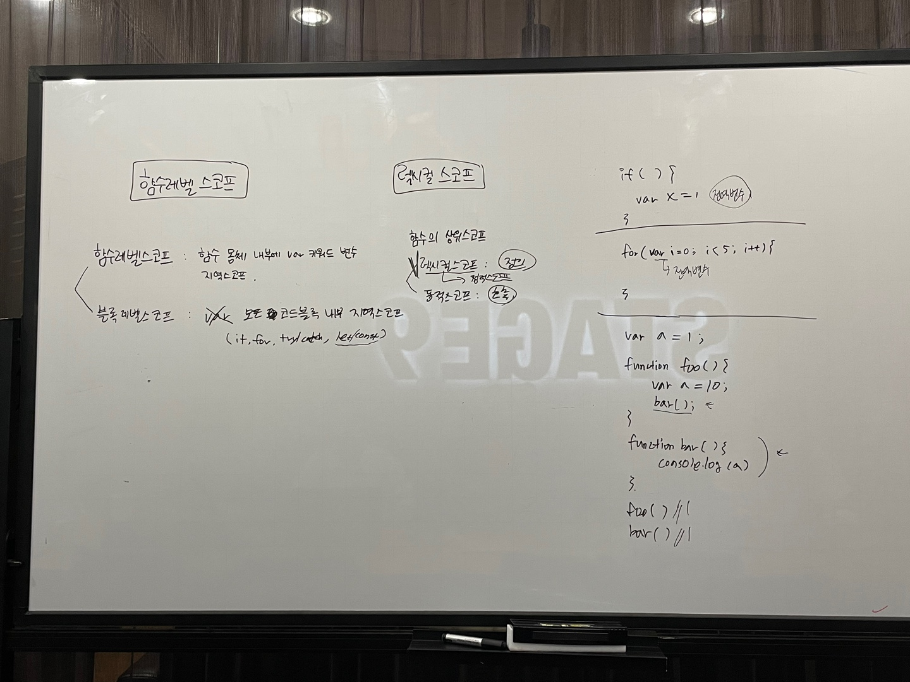

# 13장. 스코프 - 3

> 👩‍ 담당자: 황희정 
> 📝 파트: 함수레벨 스코프, 렉시컬 스코프

# 함수 레벨 스코프
지역은 함수 몸체 내부를 말하고, 지역은 지역 스코프를 만든다는 말은 "코드 블록이 아니라 함수에 의해서만 지역 스코프가 생성된다"

### 블록 레벨 스코프(block level scope) 
  - 모든 코드 블록(if, for, while, try/catch, let과 const키워드로 선언된 변수) var키워드 절대아님!

### 함수 레벨 스코프(function level scope)
  - var 키워드로 선언된 변수 (오직 함수의 코드블록(함수몸체)만을 지역 스코프로 인정한다)
  - 함수 밖에서의 var 키워드는 전역 변수다
  - var 키워드로 선언된 변수는 함수 레벨 스코프만 인정하기 때문에 함수 밖에서 var키워드로 선언된 변수는 코드 블록 내에서만 선언되었다 할지라도 모두 전역 변수다.
  (var 전역 변수는 중복 선언이 될 수 있어 의도치않게 전역변수의 값이 재할당되는 부작용이 발생할 수 있다)

### < var  vs let, const >
var 키워드로 선언된 변수는 "함수의 코드블록"만 지역 스코프로 인정하지만 
let, const 키워드는 "블록 레벨 스코프"를 지원한다.

# 렉시컬 스코프

### 함수의 상위 스코프 결정 2가지 패턴

1) 함수를 "어디서 호출"했는지에 따라 함수의 상위 스코프를 결정한다. (동적 스코프)
2) 함수를 "어디서 정의"했는지에 따라 함수의 상위 스코프를 결정한다. (렉시컬 스코프, 정적 스코프)
> 💡 자바스크립트는 렉시컬스코프(정적스코프)를 따른다.

### 렉시컬 스코프(lexical scope)란?
- 함수를 "어디서 정의"했는지에 따라 함수의 상위 스코프를 결정한다.

자바스크립트는 렉시컬 스코프를 따르므로 함수를 어디서 정의했는지에 따라 상위 스코프를 결정한다.
함수가 호출된 위치는 상위 스코프 결정에 아무 영향도 없다.
함수의 상위 스코프는 언제나 자신이 정의된 스코프다.

### 렉시컬 스코프 = 정적 스코프

상위 스코프가 동적으로 변하지않고 함수 정의가 평가되는 시점에 상위 스코프가 정적으로 결정되기 때문에 정적 스코프라고 부른다.
함수의 상위 스코프는 함수 정의가 실행될 때 정적으로 결정된다.
함수 정의(함수 선언문, 함수 표현식)가 실행되어 생성된 함수 객체는 이렇게 결정된 상위 스코프를 기억한다.
함수가 호출될 때마다 함수의 상위 스코프를 참조할 필요가 있기 때문이다.
