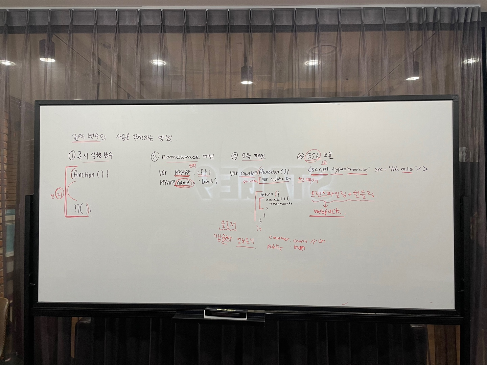

# 14장. 전역 변수의 문제점 - 3

> 👩‍ 담당자: 박하은<br/>
> 📝 파트: 전역변수의 사용을 억제하는 방법



전역 변수를 반드시 사용해야할 이유가 있는게 아니라면 지역 변수를 사용해야한다. **변수의 스코프는 좁을수록 좋다.**

## 즉시 실행 함수

함수 정의와 동시에 호출되는 즉시 실행 함수는 단 한번만 호출된다. 모든 코드를 즉시 실행 함수로 감싸면 모든 변수는 즉시 실행 함수의 지역 변수가 된다.

```js
(function() {
  var foo = 10;

}());

console.log(foo) // ReferenceError: foo is not defined
```
위 방법을 사용하면 전역 변수를 생성하지 않으므로 라이브러리 등에서 자주 사용된다.

## 네임스페이스 객체

전역에 네임스페이스 역할을 할 객체를 생성하고, 전역변수처럼 사용하고 싶은 변수를 프로퍼티로 추가하면 된다.

```js
var APP = {};
APP.name = 'hello world';
```

그러나 네임스페이스 객체 자체가 전역변수이므로 그다지 유용하진 않다.

## 모듈 패턴

이 방법은 클래스를 모방해 관련 있는 변수와 함수를 즉시 실행 함수로 감싸 하나의 모듈을 만든다.
클로저를 기반으로 동작하며, 캡슐화와 정보은닉이 가능하다.
캡슐화란 객체의 상태를 나타내는 프로퍼티와 프로퍼티를 참조하고 조작하는 동작인 메서드를 하나로 묶는 것을 말한다.
이 방법을 사용하면 외부로부터 숨길 변수와 외부에 보여줄 데이터나 메서드를 정할 수 있다.

```js
var Counter = (function() {
  var num = 0; // private

// 반환하는 객체의 데이터들은 외부로 공개된다.
return {
  increase () {
    return ++num;
  }
});

console.log(Counter.num) // undefined
```

위 예제의 즉시 실행함수는 객체를 반환하고, 이 객체의 프로퍼티는 외부에 노출된다.

## ES6 모듈

```js
<script type='module' src='lib.mjs' />
```

`script` 태그에 `type='module'` 어트리뷰트를 추가하면 로드된 자바스크립트 파일은 모듈로서 동작한다.
ES6 모듈을 사용하면 전역 변수를 사용하지 않는다. ES6 모듈은 파일 자체의 독자적인 모듈 스코프를 제공한다.
따라서 var 키워드로 선언한 변수는 전역변수도, `window` 객체의 프로퍼티도 아니다.

그러나 브라우저의 ES6 모듈 기능을 사용하더라도 트랜스파일링이나 번들링이 필요하기에 webpack 등의 모듈 번들러를 사용하는 것이 더 일반적이다.
