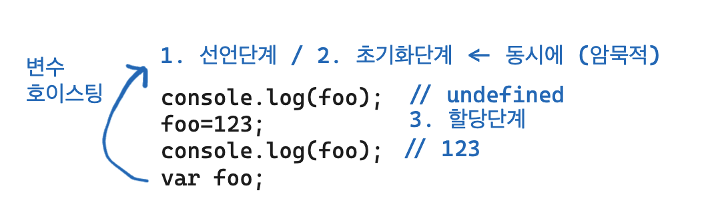
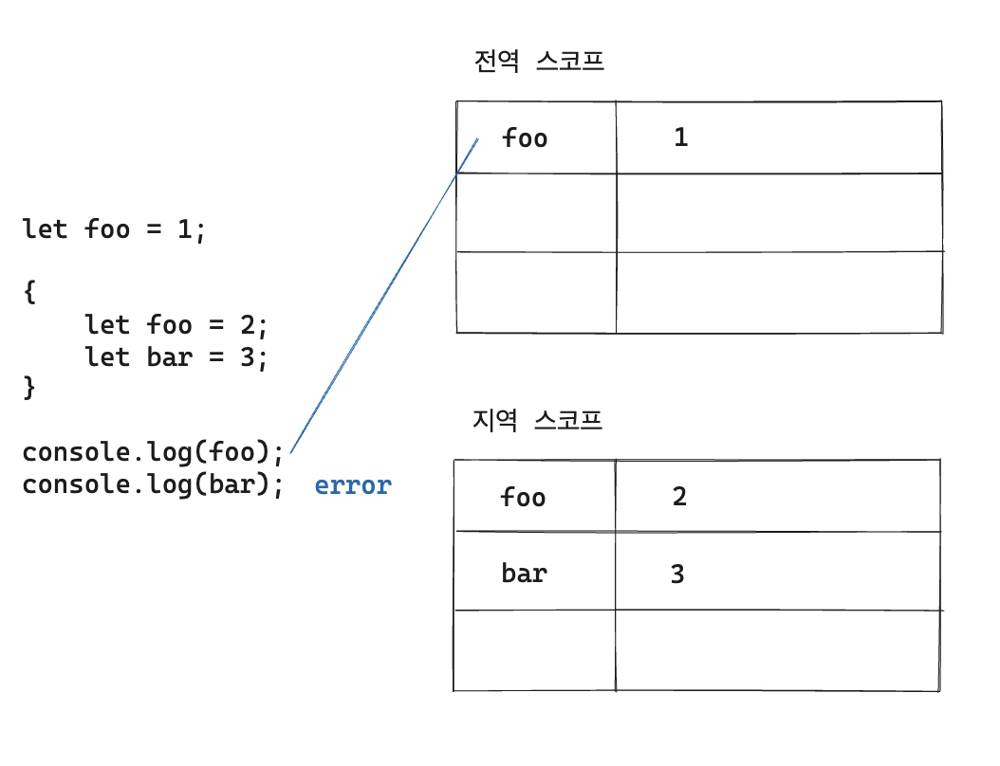
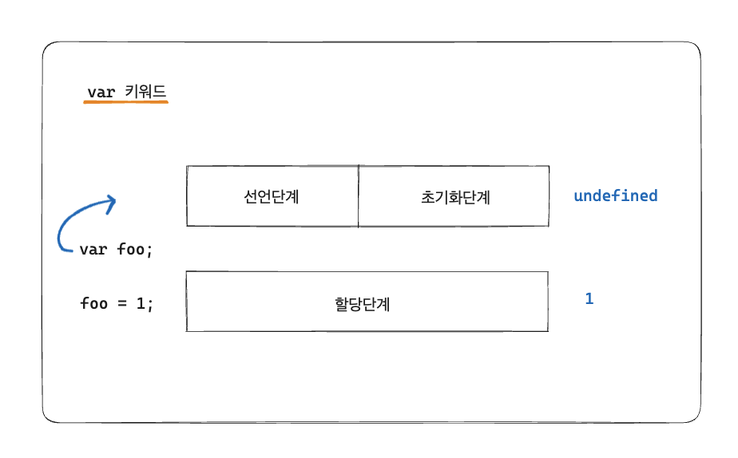
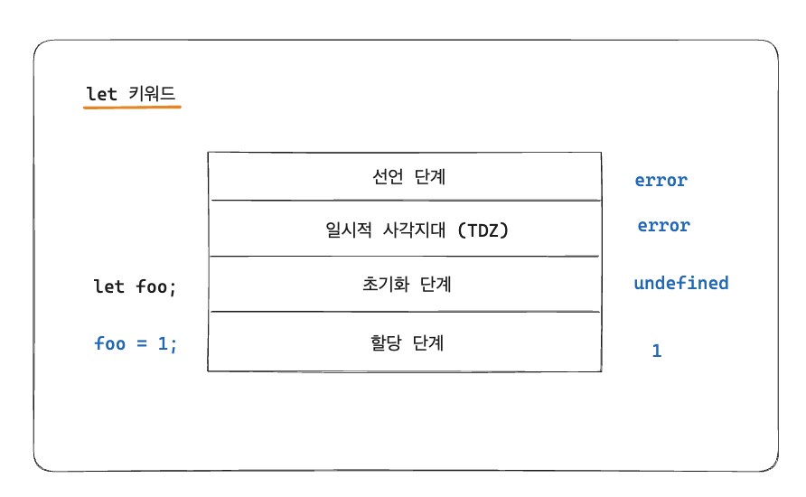

# 15장. let,const 키워드와 블록 레벨 스코프 - 1

> 👩‍ 담당자: 양현화<br/>
> 📝 파트: const 키워드, var vs let vs const.


### 15.1 var 키워드로 선언한 변수의 문제점

- var : 변수 선언 (~ES5)

1. 변수 중복 선언 허용
2. 함수 레벨 스코프
3. 변수 호이스팅

### 15.1.1 변수 중복 선언 허용

```jsx
var x = 1;
var y = 1;

var x = 100;

var y;
```

- 같은 스코프 내 중복 선언을 허용한다.

| 초기화문이 있는 변수 선언문 | var 키워드가 없는 것처럼 동작한다. |
| --------------------------- | ---------------------------------- |
| 초기화문이 없는 변수 선언문 | 무시된다 ← 에러 발생하지 않는다.   |

\*초기화문? : 변수 선언 동시에 초기값을 할당하는 문 (`var x = 10;`)

- 동일한 이름의 변수가 이미 선언되어있는 것을 모르고
- 변수를 중복선언하면서 값까지 할당했다면, **의도치않게** 먼저 선언된 변수 값이 변경되는 부작용이 발생한다.

### 15.1.2 함수 레벨 스코프

- var 키워드로 선언한 변수는 오로지 함수의 코드 블록만을 지역 스코프로 인정한다.
- 함수 레벨 스코프는 전역 변수를 남발할 가능성을 높인다. → **의도치않게** 전역 변수가 중복 선언되는 경우 발생

```jsx
var x = 1;

if (true) {
  var x = 10;
}

console.log(x); // 10
```

```jsx
var i = 10;
for (var i = 0; i < 5; i++) {
  console.log(i);
}

console.log(i);
```

### 15.1.3 변수 호이스팅

- var 키워드로 변수를 선언하면 변수 호이스팅에 의해 변수 선언문이 스코프의 선두로 끌여올려진 것처럼 동작한다.
- → 변수 선언문 이전에 참조할 수 있다.
- 할당문 이전에 변수를 참조하면 언제나 undefined가 반환된다.



### 15.2 let 키워드

- 이런 단점들을 보완하려고 ES6에서는 let, const 키워드가 도입되었다.

### 15.2.1 변수 중복 선언 금지

- 변수를 중복 선언하면 문법 에러 발생 → has already been declared

```jsx
var foo = 123;
var foo = 456;

let bar = 123;
let bar = 456; // has already been declared
```

### 15.2.2 블록 레벨 스코프

- 모든 코드 블록을 지역 스코프로 인정한다. (함수, if, for, while, try/catch문 등)



- 모든 코드 블록을 지역 스코프로 인정한다. (함수, if, for, while, try/catch문 등)


### 15.2.3 변수 호이스팅

- let 키워드로 선언한 변수는 변수 호이스팅이 동작하지 않는 것처럼 동작한다.

```jsx
console.log(foo); // 참조에러
let foo;
```

- var 키워드
  
- 암묵적 선언 + 초기화(undefined) 동시 진행
- 즉, 선언단계 → 스코프에 변수 식별자 등록 & 즉시 초기화 (undefined)
- 따라서 변수 선언문 이전에 접근해도, 스코프에 변수가 존재하기 때문에 에러는 발생하지 않는다. (undefined 반환)

- let 키워드
  
- 선언단계 ||| 초기화 단계 분리되어있다.
- JS 엔진에 의해 식별자가 등록은 되지만, 등록만 해놓는다. (호이스팅은 하는 것)
- 일시적 사각지대 발생
- 변수 선언문 단계에서 초기화가 진행된다.

- JS는 모든 선언 (var, let, const, function, funciont\*, class 등)을 호이스팅 한다.
- 단, let, const, class를 사용한 선언문은 호이스팅이 발생하지 않는 것 처럼 동작한다.
