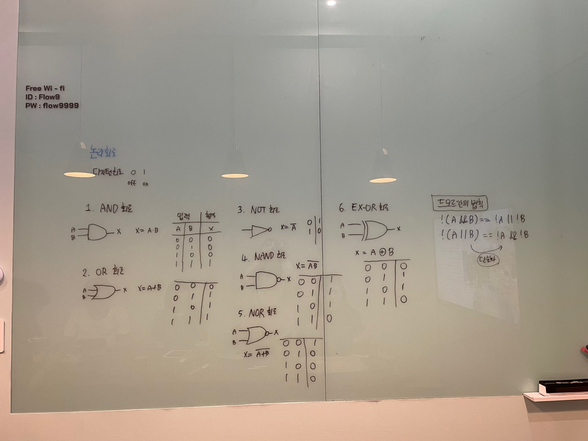
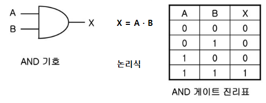
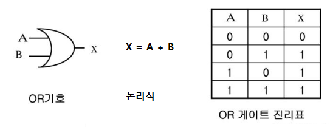
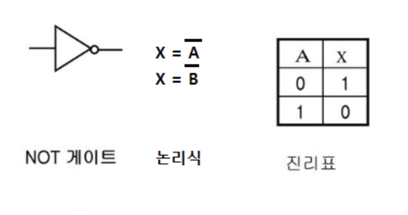
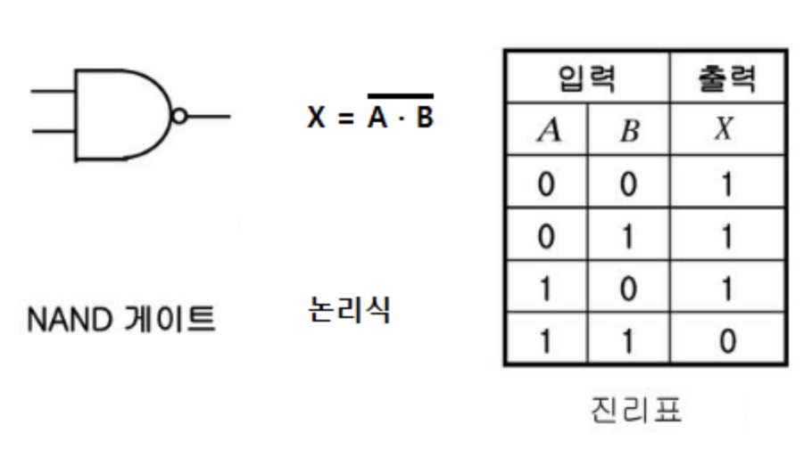
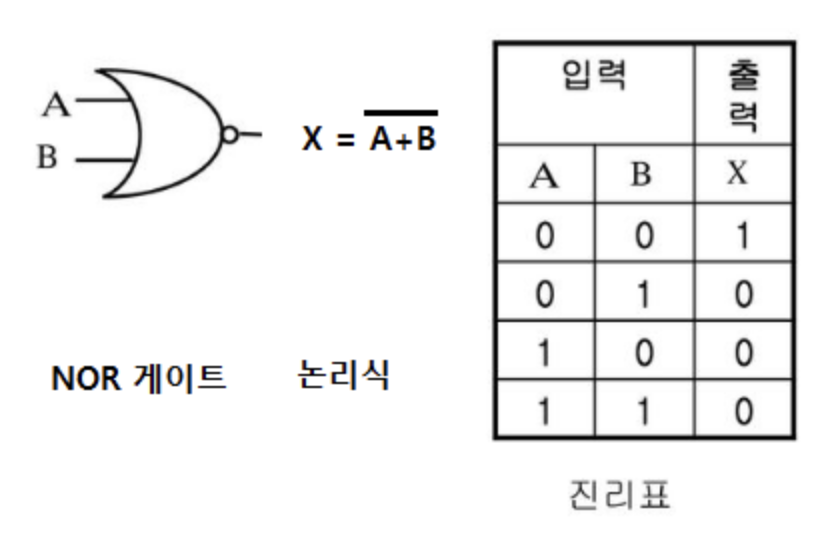
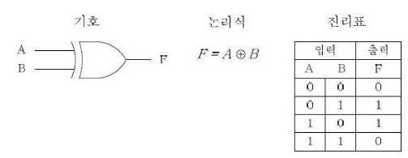

# 심화 학습
> 👩‍ 설명: 황희정<br/>
> 📝 정리: 황희정



### Agenda

#### 1. 논리회로
#### 2. 드모르간의 법칙

---

## 1. 논리회로

### AND 회로

입력 신호 A, B가 있을 때 출력이 나오는 회로이며 스위치의 직렬회로이다. (교집합)



### OR 회로

입력 신호 A, B 중에 하나만 1이 되어도 출력이 나오는 회로이며 스위치는 병렬회로이다. (합집합)



### NOT 회로

입력의 상태가 반전되는 회로이다. 인버터라고 한다.




### NAND 회로

AND회로와 NOT회로의 합으로 AND회로를 부정하는 회로이다.




### NOR 회로

OR회로와 NOR회로의 합으로 OR회로를 부정하는 회로이다.




### EX-OR 회로 (배타적 OR, Exclusive OR)

입력측의 값이 같을 때는 출력이 나타나지 않고 입력값이 서로 다를 경우에 출력이 나타나는 논리적 합 회로라고 한다.



## 2. 드모르간의 법칙

드모르간의 법칙은 19세기 영국의 수학자 오거스터스 드모르간이 제안한 논리 이론이다.<br/>
드모르간의 법칙은 두 가지 형태로 표현되며, 논리 연산의 부정과 관련된 "AND"와 "OR"의 관계를 설명한다.<br/>
이 법칙은 복잡한 논리 표현식을 단순화하는 데 도움이 된다.<br/>

```javascript
!(A || B) === (!A && !B)
!(A && B) === (!A || !B)
```
드모르간의 법칙을 사용하면 "A와 B가 모두 아니라면 C를 실행한다"라는 복잡한 조건을 "A가 아니거나 B가 아니라면 C를 실행한다"로 단순화할 수 있다. 
따라서 코드의 가독성을 높힌다.
