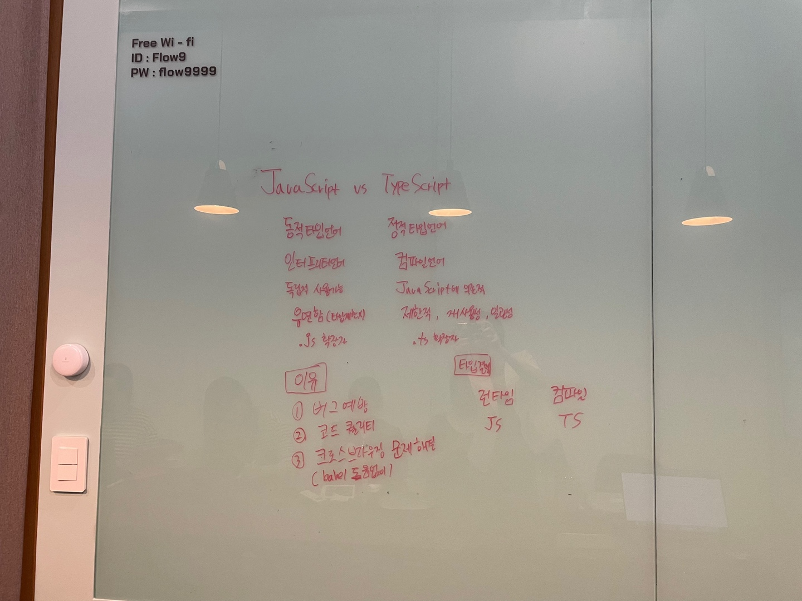

# 심화 학습
> 👩‍ 설명: 황희정 
> 📝 정리: 황희정

## JavaScript vs TypeScript

### Agenda

#### 1. JavaScript와 TypeScript의 차이
#### 2. TypeScript를 사용해야하는 이유
#### 3. 타입 결정 시점

[내용 정리 바로가기](https://github.com/goatFE/TIL/blob/main/JavaScript/JavaScript&TypeScript.md)
