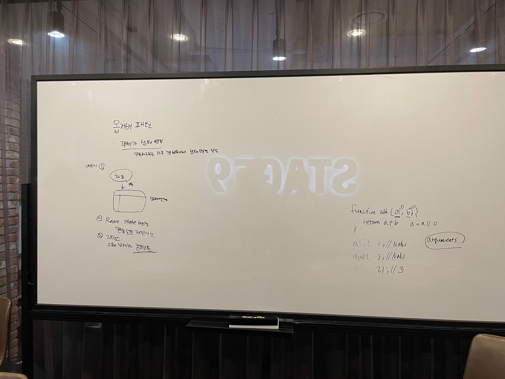

# 심화 학습
> 👩‍ 설명: 황희정 
> 📝 정리: 황희정

## 옵저버 패턴

### Agenda

#### 1. 옵저버 패턴이란?
#### 2. 옵저버 구현 예시
#### 3. 리덕스 스토어 상태변경시, 컴포넌트 리렌더링도 옵저버패턴이다.

[내용 정리 바로가기](https://github.com/goatFE/TIL/blob/main/JavaScript/%EC%98%B5%EC%A0%80%EB%B2%84%ED%8C%A8%ED%84%B4.md)
