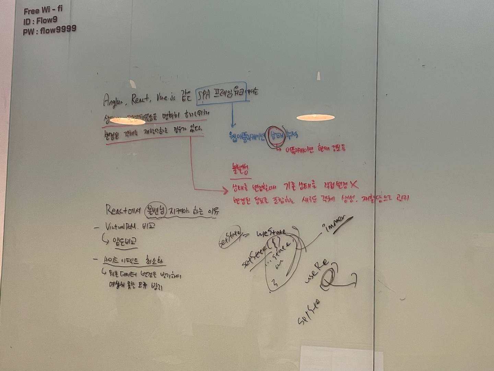

# 심화 학습
> 👩‍ 설명: 황희정 
> 📝 정리: 황희정

### Angular, React, Vue같은 SPA 프레임워크에서는 상태가 변경되었음을 명확히 하기 위해 변경된 객체를 재할당하는 경우가 있다

### Agenda

#### 1. SPA 프레임워크에서는 상태가 변경되었음을 명확히 하기 위해 변경된 객체를 재할당하는 경우가 있다
#### 2. 왜 리액트에서 불변성을 지켜야하나?

---

### SPA 프레임워크에서는 상태가 변경되었음을 명확히 하기 위해 변경된 객체를 재할당하는 경우가 있다

SPA(Single Page Application) 프레임워크들은 웹 애플리케이션의 상태를 추적하고, 
사용자 인터페이션 업데이트를 관리하기 위해 "상태" 라는 개념을 사용한다. 
상태는 애플리케이션의 현재 정보를 나타낸다.

Angular, React, Vue 등의 프레임워크에서 상태의 변화를 관리하고 반응하기 위해 상태를 변경하는 것이 중요하다. 
이러한 프레임워크들은 불변성(Immutability)이라는 개념을 강조함.
불변성이란 한번 생성된 값이 변하지 않는다는 원칙이다. 
그러나 객체는 변경 가능한 값이므로 불변성을 유지하기위해 새로운 복사본을 생성한다.
따라서, 상태를 변경할 때 기존의 상태 객체를 직접 변경하는 것이 아니라, 
변경된 정보를 포함하는 새로운 객체를 생성하여 재할당하는 방식을 사용한다.

### 왜 리액트에서 불변성을 지켜야하나?

리액트에서 불변성을 지켜주는 이유는 리액트가 상태 업데이트를 하는 원리 때문이다. 
리액트는 상태값을 업데이트 할 때 얕은 비교를 수행한다. 
즉 배열이나 객체의 속성 하나하나를 비교하는게 아니라 
이전 참조값과 현재 참조값만을 비교하여 상태 변화를 감지한다.
이런 이유로 배열이나 객체를 업데이트 할때 `setState([...state, newState]), setState({...state, [key]: value})` 이런식으로 새로운 참조값을 가진 배열이나 객체를 생성하는 것이다. 
불변성을 지킴으로써 리액트는 상태변화를 감지할 수 있다.

1. 효율적인 상태업데이트 (얕은 비교 수행)  
   얕은 비교란 객체의 프로퍼티를 하나하나 다 비교하지 않고, 객체의 참조 주소값만 변경되었는지 확인한다. 
   얕은 비교는 계산 리소스를 줄여주기 때문에 리액트는 효율적으로 상태를 업데이트 할 수 있다.
  
2. 사이드 이펙트 방지 및 프로그래밍 구조의 단순성
   원시타입은 애시당초 불변성 특징을 가지고 있지만, 참조타입인 객체나 배열의 경우 값을 변경할 때 원본데이터가 변경될 여지가 있다.
   이렇게 원본 데이터가 변경될 경우, 이 원본데이터를 참조하고 있는 다른 객체에서 예상치 못한 오류가 발생할 수 있고 프로그래밍의 복잡도도 올라간다. 
   따라서 불변성을 지켜주면 사이드 이펙트를 방지하고 프로그래밍의 구조를 단순하게 유지할 수 있다.
